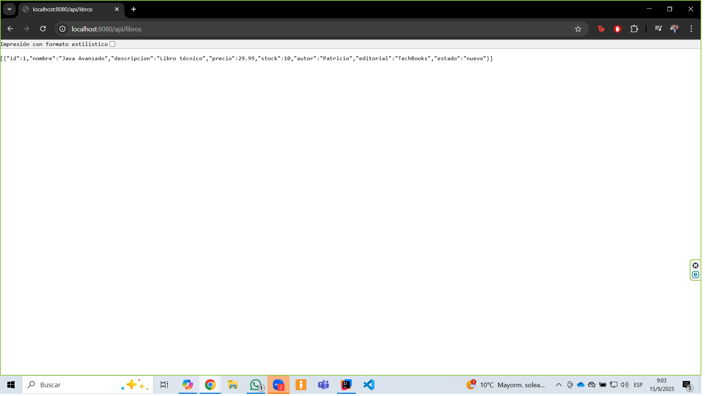
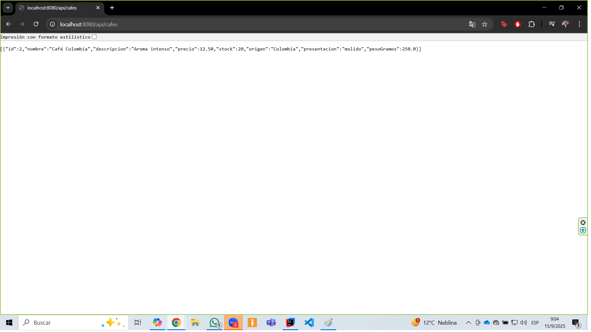
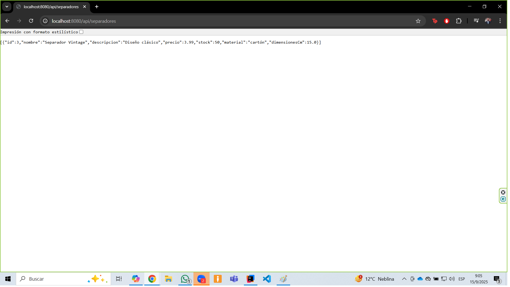
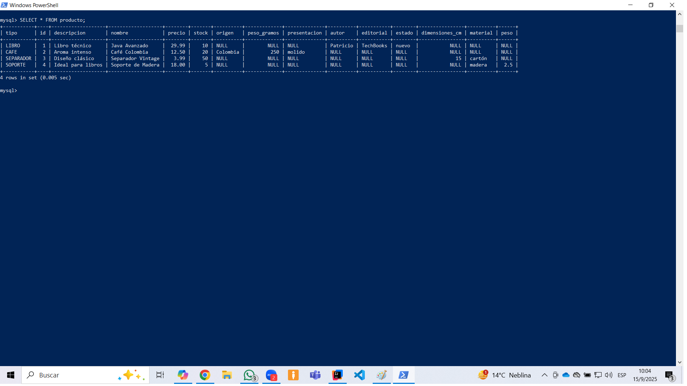
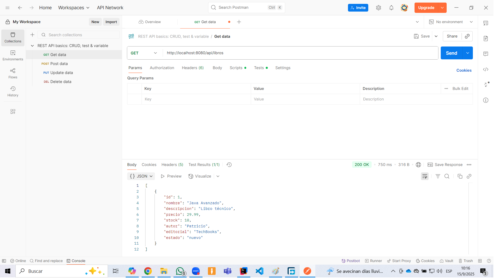
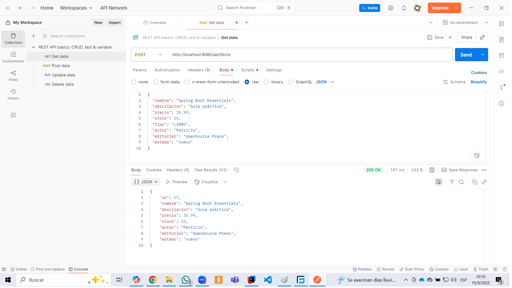
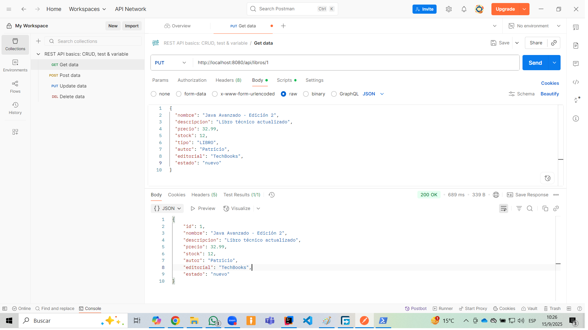
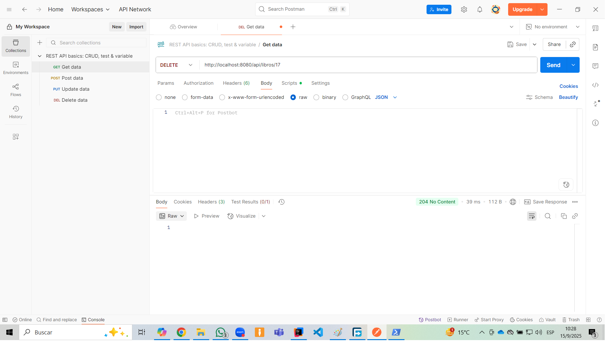
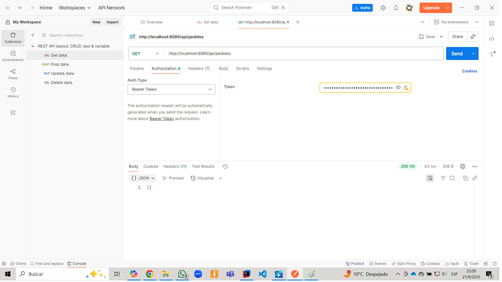
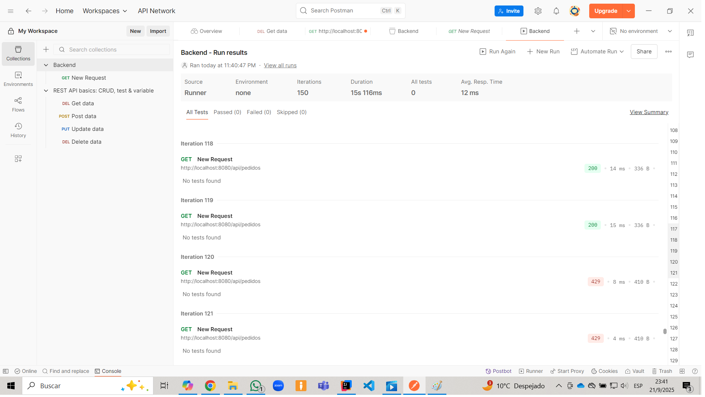

# 📚 Librería Saint Patrick - Backend

Este proyecto implementa el backend de una librería virtual utilizando Spring Boot, Spring Data JPA y MySQL. Forma parte del proyecto de construcción de una plataforma eCommerce robusta, modular y trazable.
---

## 🚀 Tecnologías utilizadas

- Java 17
- Spring Boot 3.x
- Spring Data JPA
- MySQL 8.x
- Maven
- IntelliJ IDEA
- Git & GitHub

---

## 🧠 Arquitectura del sistema

El backend sigue una arquitectura limpia y profesional basada en:
- Controladores REST (@RestController)
  Cada entidad tiene su propio controlador para gestionar las operaciones CRUD y flujos específicos.
- Servicios desacoplados
  La lógica de negocio está encapsulada en servicios como ProductoService y PedidoService, con separación clara de responsabilidades.
- Repositorios JPA
  Interfaces que extienden JpaRepository para acceso a datos, con consultas personalizadas cuando es necesario.
- Entidades con herencia (@Inheritance(strategy = SINGLE_TABLE))
  Para modelar productos como Libro, Cafe, Separador, Soporte en una sola tabla con discriminador.
- Relaciones bidireccionales bien mapeadas
  Uso de @OneToMany(mappedBy = "pedido") y @ManyToOne con @JoinColumn para trazabilidad entre Pedido y PedidoItem.
- DTOs y mapeadores personalizados
  Para evitar ciclos de serialización y controlar la estructura de las respuestas JSON

---

## 🔐 Seguridad

- Autenticación basada en JWT
- Autorización por roles (USER, ADMIN) usando @PreAuthorize
- Segunda capa de seguridad con RateLimitFilter


## 🗃️ Integración con base de datos

- Base de datos relacional: MySQL
- Configuración en application.properties
- Carga inicial de datos vía data.sql
- Generación automática de IDs con @GeneratedValue(strategy = GenerationType.IDENTITY)
- Eliminación segura de historial con control de integridad referencial
- Limpieza estructural de tablas auxiliares innecesarias (pedido_items)
- Reinicio de secuencias y contadores para entornos de desarrollo

---

## 🛒 Gestión de pedidos y carrito
- Carrito persistente en sesión (HttpSession)
- Endpoints para agregar, ver y pagar el carrito
- Conversión de ítems del carrito a PedidoItem con vinculación explícita al Pedido
- Cálculo del total del pedido y persistencia completa
- Recarga del pedido recién creado para garantizar que los productos estén incluidos en la respuesta


## 📦 Endpoints disponibles

```http
GET     /api/libros
GET     /api/cafes
GET     /api/separadores
GET     /api/soportes

GET     /api/pedidos
POST    /api/pedidos
DELETE  /api/pedidos/{id}
PUT     /api/pedidos/{id}

POST    /api/pedidos/carrito/agregar
GET     /api/pedidos/carrito
POST    /api/pedidos/carrito/pagar

```
---

## 📦 Capturas de la aplicación en funcionamiento

  




  





